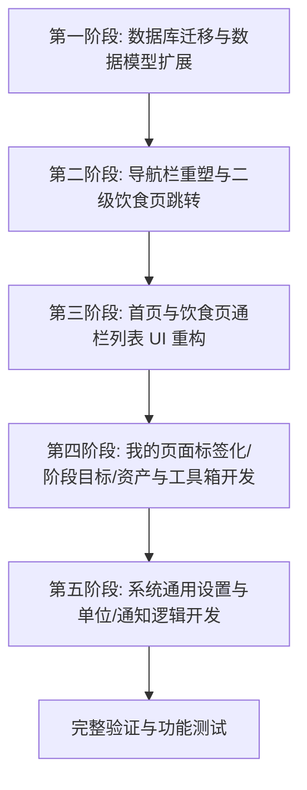

# 健康App页面重构方案设计文档

**设计日期**：2026年7月3日
**设计主题**：关于健康管理 App 进行“短操作路径”和“数据重组”的重构方案设计
**指导思想**：**“核心操作路径最短”** 与 **“高频动态数据外露，低频静态数据内聚”**

---

## 👨‍🏫 教授的课前寄语

你好，同学！感谢你的及时提醒。在系统性的重构方案中，我们绝不能丢掉任何一处提高系统“丰满度”和“人性化”的细节。

这次补充的修改方案对于“我的”页面有非常关键的拓展：通过引入**【阶段目标】整合**、**【内容资产】的自定义动作与常用食谱**，以及包含**“显示/单位”、“通知提醒”、“数据备份与清除”和“关于”**在内的**【系统通用设置】纵向扩展**，App 能够从一个基础的工具彻底蜕变为具备完整功能生态的“个人健康管家”。

下面，老师将结合你的反馈，全面升级“为什么（Why）”和“怎么做（How）”的技术与设计方案，确保将这些重构要素完美融入执行中。

---

## 🔍 核心模块可行性分析与技术架构设计

### 一、 导航栏架构调整 (Tab Bar) —— 精简与意象重构

#### 1. 为什么合理？（Why）

- **高频外露**：将原本的 5 个 Tab 缩减为 4 个（移除“饮食”顶级 Tab，降级为首页饮食卡片的二级跳转），有效减少视觉层级。
- **黄金中轴加号**：将快速记录悬浮加号（+）收纳到导航栏正中央，作为核心手势区的超级入口，缩短高频操作的触达路径。
- **重新定义“日历”意象**：
  - 将“锻炼”Tab 更名为“日历”，图标由“哑铃”升级为“日历格子”。其核心定位从“单一的训练计划”扩展为“整个健康与训练的历史时间轴看板”。
  - 为了避免视觉上的冲突，“记录”Tab（原先使用日历/笔记本图标）需要同步重构为“翻开的书本/日记本”图标，与“日历”的纯格子意象进行明显区隔。

#### 2. 怎么实现？（How）

- **矢量图标重绘与替换**：
  - **日历 Tab**：直接继承原本在 `ic_nav_checkin_outline.xml` / `ic_nav_checkin_filled.xml` 中的“穿金属圈日历格子”路径。
  - **记录 Tab**：将 `ic_nav_checkin_outline.xml` 里的路径内容替换为 `ic_book.xml` 里的翻开日记本路径（线段本子意象），使其更符合“日记记录”的隐喻。
- **ViewPager2 改造**：在 [MainHomeFragment.java](file:///d:/code/JaProject/FitnessDiary/app/src/main/java/com/cz/fitnessdiary/ui/fragment/MainHomeFragment.java) 中，将适配器 count 设为 4，移除 DietFragment。饮食卡片点击时，通过 `navController.navigate(R.id.dietFragment)` 以独立页面调起。

---

### 二、 首页记录页面重构 —— 消除冗余与数据聚焦

#### 1. 为什么合理？（Why）

- **首屏去噪**：剔除跟下方具体卡片严重重叠的静态“今日任务”列表。
- **饮食卡片升级**：不仅展示卡路里，还直接追加“脂肪”的摄入克数与进度条。
- **首页大圆环评分改进：**改进健康评分明细规则，使其更合理，并优化以进度条形式说明各进度。

#### 2. 怎么实现？（How）

- **Room 数据库版本升级 (23 -> 24)**：
  - 老师提醒你，由于原 `FoodRecord` 表缺少脂肪字段，必须进行表升级。
  - 在 `FoodRecord.java` 中增加 `fat` 属性；在 `AppDatabase.java` 中将 `version` 提升至 `24`，并编写迁移脚本：
    ```java
    static final Migration MIGRATION_23_24 = new Migration(23, 24) {
        @Override
        public void migrate(@NonNull SupportSQLiteDatabase database) {
            database.execSQL("ALTER TABLE food_record ADD COLUMN fat REAL NOT NULL DEFAULT 0.0");
        }
    };
    ```
  - 用户脂肪的目标值，在 `User.java` 中通过 getter 公式动态计算（每日热量目标 $\times 25\% \div 9$kcal），规避对 User 表结构做 Migration 带来的多表维护压力。

---

### 三、 饮食二级页面重构 —— 流式交互与快捷录入

#### 1. 为什么合理？（Why）

- **追踪宏量三巨头**：看板由双条重塑为“碳水 / 蛋白质 / 脂肪”并排三段式进度条，信息更完整。
- **四宫格变通栏列表**：原本的 2x2 网格改为纵向堆叠的通栏长条卡片，且列表内部流式展示具体食物（如：*鸡蛋 x2、燕麦 50g*），用户不用点击卡片弹窗就能一眼看清。
- **搜索内聚与快捷录入**：
  - 扫码和 AI 照相机直接嵌入搜索框右侧作为快捷图标。
  - 搜索框正下方自动聚合用户本周吃的最频繁的 4 种“常用食物”，点击即可按默认 1 份直接录入。

#### 2. 怎么实现？（How）

- **卡片自适应高度**：修改 `include_meal_card.xml`，将其高度由 `160dp` 调整为 `wrap_content`，使 `tv_food_summary` 可流式无限换行显示。
- **高频 SQL 聚合查询**：在 `DietViewModel` 中添加 SQL 聚合查询方法 `getFrequentFoods()`，按记录次数排序，拉取常用食物 chip 展示。

---

### 四、 我的页面重构 —— 静态内聚与纵向扩展

为了彻底改变原页面零散、单薄的问题，我们将遵循以下规划进行深度重塑：

#### 1. 基础属性与身体数据内聚

- **标签化**：去掉“年龄”和“性别”卡片，浓缩为 `👦 男 · 23岁` 标签，挂在头像下方。年龄的修改将结合“生日”选择自动根据年份更替。
- **身体数据大一统**：合并身高、体重、BMI、BMR 为一块通栏卡片 **【 身体数据】**。点击后跳转二级页，包含体重、体脂率、腰围等长期历史趋势折线图（使用 `MPAndroidChart` 库绘制）。同时将数据周报和日历历史统计中的趋势折线图移除，全部归口在此处。
- **健身目标块**：将原本分散的“当前目标（增肌/减脂）”和“活动水平（久坐/轻度/重度）”合并为一个统一的 **【健身目标】** 模块，视觉上更加内聚。
- **勋章与周报统一：**将原成就勋章墙和数据周报综合到荣耀与分析模块，同时将首页的健康日报移到此处展示。

#### 2. 纵向扩展丰富度板块

在“我的”页面下方，以圆角卡片流布局（统一的 3D 微拟态卡片视觉）顺次添加以下四个重量级功能：

- **【🛠️ 健身工具箱】**：
  - **1RM 极限重量计算器**：采用经典 Epley 公式 $1RM = Weight \times (1 + \frac{Reps}{30})$。
  - **TDEE 每日总能耗精算器**：采用 Mifflin-St Jeor 公式进行代谢率精精算。
- **【📂 我的内容资产】**：
  - **动作管理**：用户自行创建和维护的非标动作，可关联至训练计划中。
  - **常用食谱**：允许用户将“高频连吃健身餐”（如：鸡胸肉+西兰花+糙米饭）打包保存，实现一键批量添加。
- **【🔄 设备与连接】**：
  - 展示 Apple Health / Google Fit / 智能手环 / 体脂秤的自动绑定状态。
  - 目前仅作 UI 视觉呈现，状态显示为“待开发 / 即将推出”。
- **【⚙️ 系统通用设置】**：
  - **显示与单位设置**：切换重量单位（kg / 斤）、热量单位（kcal / kj），以及外观主题（浅色 / 深色 / 跟随系统）。
  - **通知与提醒管理**：提供用药、饮水、训练、饮食记录的系统推送开关，以及全局的智能推送开关。
  - **数据管理设置**：将原右上角的备份、恢复、清除数据功能以及隐私说明收纳于此。
  - **每日目标综合设置**：饮水、步数、运动时长、体重每日目标设置。
  - **清除缓存**：清除图片和AI私教对话历史
- **【关于 健康日记】**：
  - **关于 FitnessDiary**：简要版本号说明及开发日记说明。
  - **引导回顾**：重新展示新手引导回顾。
  - 推荐给好友：分享APK。
  - 意见反馈：邮箱反馈意见。

---

## 📈 执行路线图


